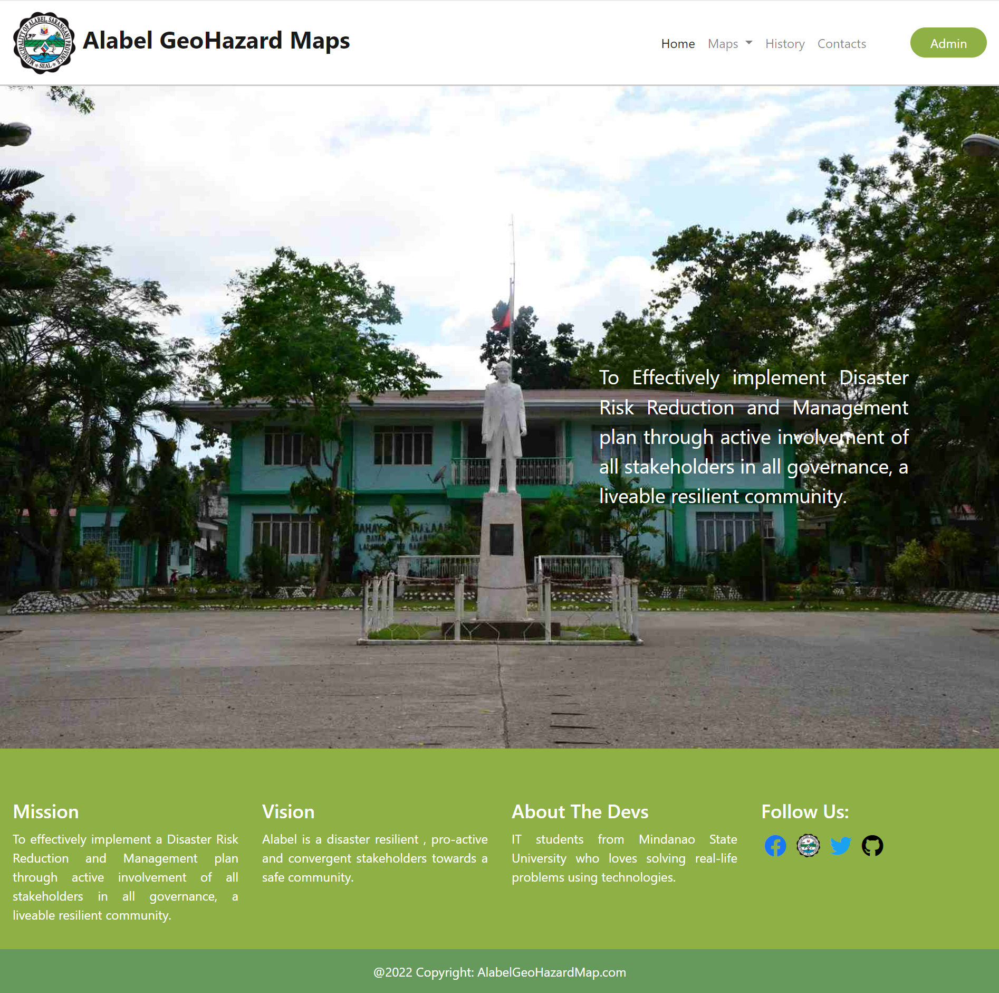
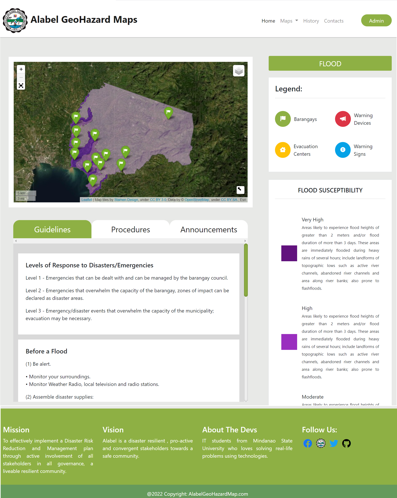
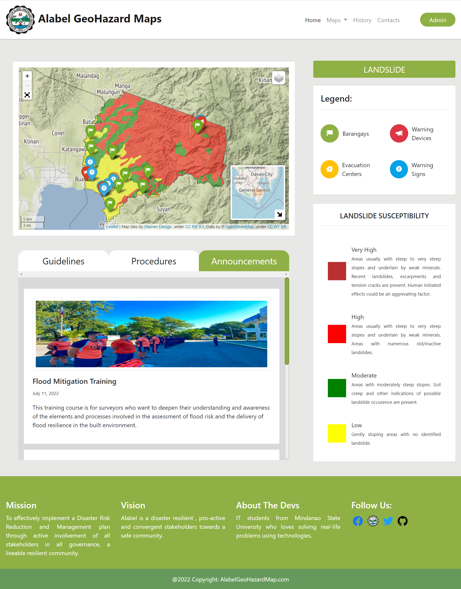

# Alabel GeoHazard Maps

 &nbsp A university capstone project that aims to help the local government of Alabel regarding the dissemination of GeoHazards and other GeoScience information. 

 &nbsp This is a web application that displays GeoHazard (Flood & Landslide) regions in the Municipality of Alabel (Philippines). Markers, map layers, and other mapping tools
were used to render the project successful. The project were built by students from Mindanao State Univesity (MSU - Gensan) using a python web-framework called "Django" 
and the library "Folium".

  

 &nbsp Below images are the GeoHazard maps that emphasizes both the "Landslide" and "Flood" regions of Alabel. On the pages' sidebar we can see the markers' definition, although not shown
in the images below; but each marker has a unique popup description when clicked.

  
 

We couldn't have pulled this off without the helped of the following people: 
* Sohanur Rahman Shanto
* Christian Glory
* Bernhard Vallant
* Maxim Danilov
* KenWhitesell
* Jethro Sedoguio

Reddit Users:
* shiuidu
* imjustnoob45
* Narfi1
* welcome_cumin
* Boryalyc
* mca62511

We're tremendously grateful to you all!
